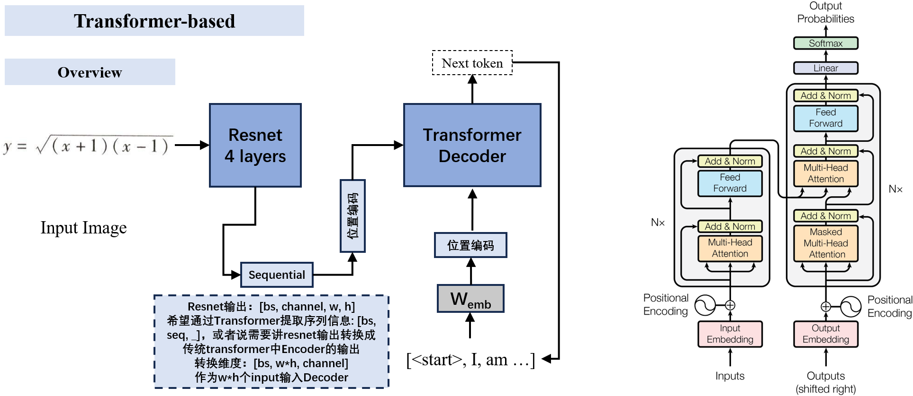
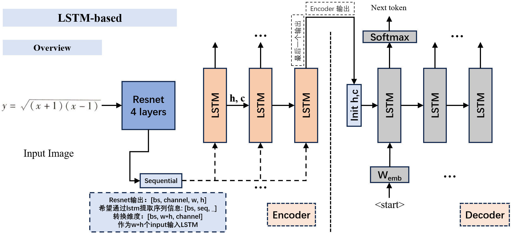

# Quasi-Mathfix

---

A simple image-to-latex recognizer.

---

## Requirements
```
pip install requirements.txt
```

---

## Overview
```
|- dataset.py                                       : construct dataset
|- data_process/                                    : data process
   |- cn_vocab.txt
   |- dataset.py
   |- data_filter.py
   |- extract_image_according_to_label_list.py
   |- fmm.py
   |- pad_image.py
   |- vocab.txt
|- load_data/                                       : saved data
   |- saved_tokenizer1.pkl
   |- saved_tokenizer2.pkl
   |- task1.json
   |- task1_eval.json
   |- task2.json
   |- task2_eval.json
|- model/                                           
   |- lstm.py                                       : LSTM-based model
   |- transformer.py                                : Transformer-based model
|- README.md
|- requirements.txt
|- run.py                                           : main enterance
|- runner.py                                        : manage train or test process
|- score.py                                         : testing metrics
|- tokenizer.py                                     : tokenizer
|- utils.py                                         : some useful interfaces
```

---

## Running
* **Training**
1. Prepare your dataset. This project is not to release the dataset, but you can construt your own dataset.
2. Trigger training. Set the `training` variable to `True`, and then
```
python run.py
```
* **Testing**
Set the `training` variable to `True`, and then
```
python run.py
```

## Model architecture

* **Transformer-based**


* **LSTM-based**


